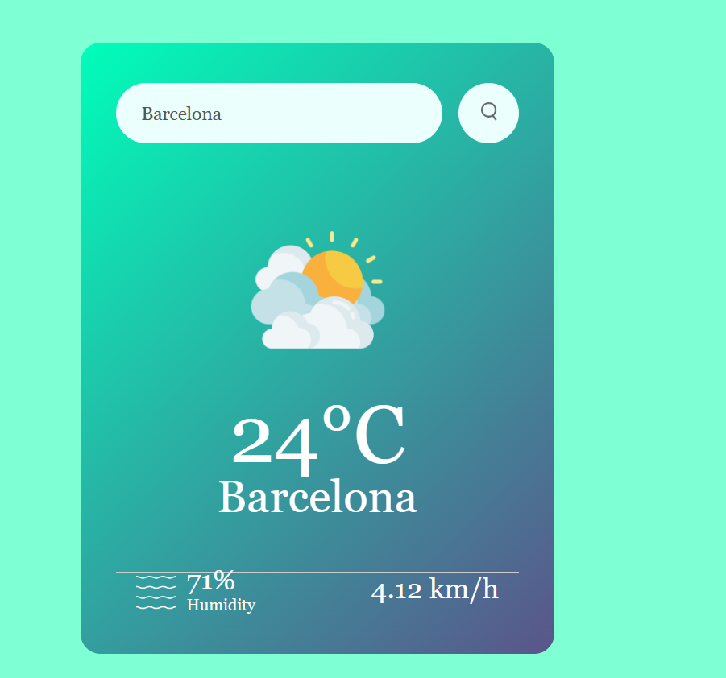

# Weather App

A simple weather app that allows users to search for the weather of a city and display relevant information using the OpenWeatherMap API.

## Table of Contents

- [Features](#features)
- [Demo](#demo)
- [Technologies Used](#technologies-used)
- [Usage](#usage)
- [Contributing](#contributing)

## Features

- Search for weather information by entering a city name.
- Display temperature, city name, humidity, and wind speed.
- Show weather icons based on the weather condition.

## Demo

## Technologies Used

- HTML
- CSS
- JavaScript

## Usage
-Enter a city name in the search input and click the search button.
-Weather information for the entered city will be displayed, including temperature, humidity, wind speed, and a weather icon.

## Contributing

Contributions are welcome! If you find any issues or want to add improvements, feel free to create a pull request.

